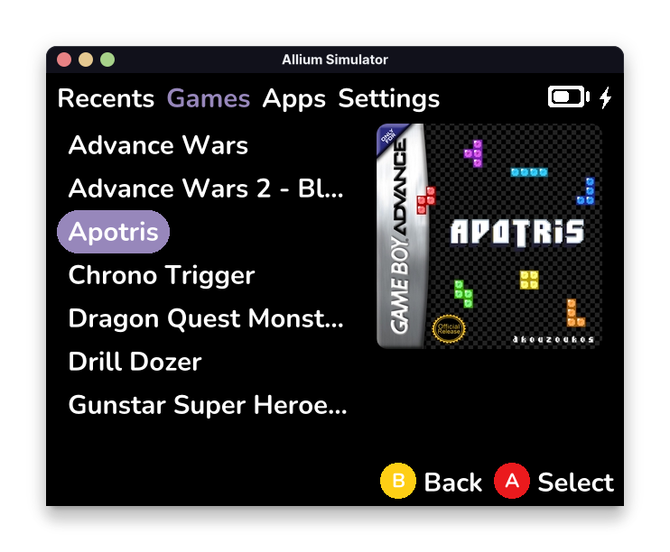
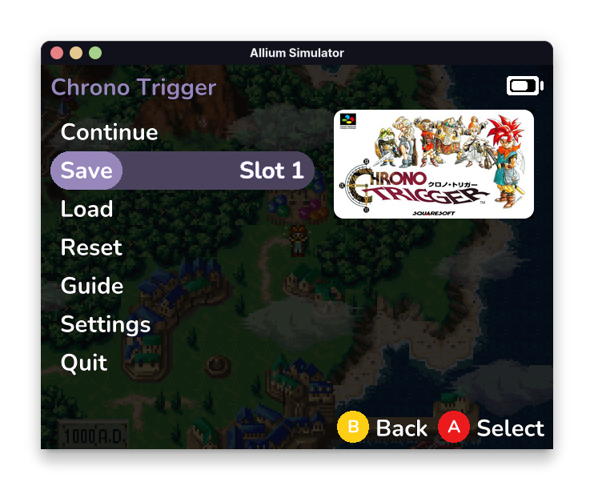
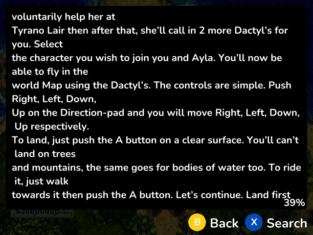
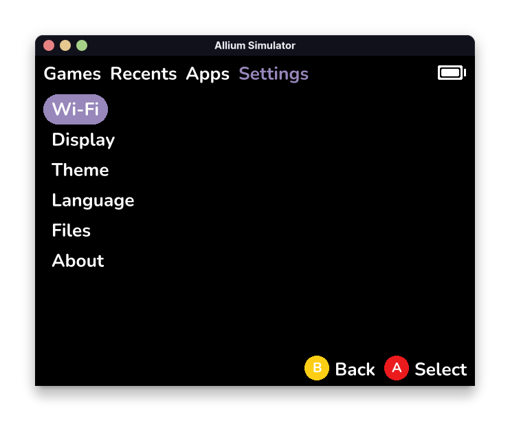
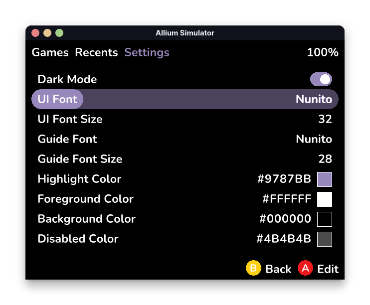
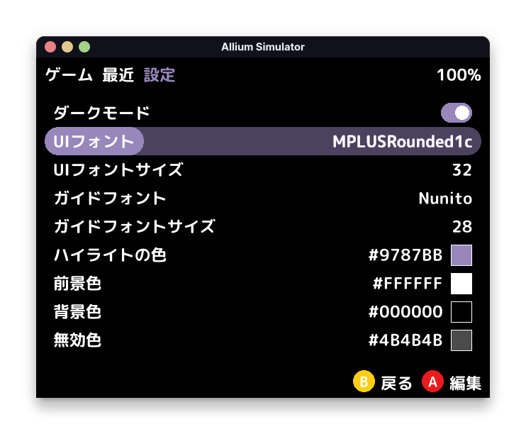

# Allium

Allium is a custom launcher for the Miyoo Mini and Miyoo Mini Plus handheld devices, similar to [OnionOS](https://github.com/OnionUI/Onion) and [MiniUI](https://github.com/shauninman/MiniUI).

## Project Goals

The goal of Allium is to replace MainUI (stock UI) with a faster and more user-friendly UI.
- Fast
- Clean, user-friendly UI
- RetroArch (with Netplay, achievements)
- Box art
- Support running on both Miyoo Mini and Miyoo Mini Plus without changes

# Screenshots

<div>
    
    
    
    
    
    
</div>

## Installation

Allium supports both the Miyoo Mini and Miyoo Mini Plus on the same SD card.

1. Format the SD card to [FAT32](https://github.com/anzz1/DotUI-X/wiki/fat32format).
2. Download the latest release and extract into your SD card. e.g. `E:/`.
3. Eject the disk (**important!**).

The SD card layout should look like this:
- .allium
- .tmp_update
- BIOS
- RetroArch
- Roms
- Apps
- Saves (optional, if you have existing saves from OnionOS)

## Features
- Supports stock/Onion/DotUI SD card layout
- Works without configuration
- Box art (250px wide, PNG, JPG, GIF)
- Supports gameslist.xml with nested folders
- Recents list (sort by last played or playtime)
- Search games by name
- Activity tracker
- [RetroArch for all supported cores](https://github.com/goweiwen/Allium/wiki/Console-Mapper)
- Volume & Brightness (menu + l/r/u/d) control
- In-game menu (save & load with screenshots, reset, access RetroArch menu, [guide](https://github.com/goweiwen/Allium/wiki/In-game-Guide-Walkthrough-Reader), disk changer, quit)
- Automatic resume when powering off/on
- Suspend
- Settings page
    - WiFi (IP Address, NTP, Telnet, FTP)
    - Date, time, timezone
    - Change LCD settings
    - Customize theme colours, font
    - Change system language

## Planned Features
(roughly in order of priority)
- Favorites
- Theme manager
    - Built-in themes
    - Save current theme to file
    - Background images
- UI improvements:
    - Folder icon
    - Volume indicator
    - Brightness indicator
    - Error toast (e.g. no core found for game)
    - Anti-aliased circles
- WiFi stuff (wifi stuff is deprioritized because I mainly carry a MM without wifi):
    - OTA update
    - Metadata/box art scraper
    - Cloud save sync
    - Seamless netplay from ingame menu

## Development

Allium comes with a simulator that can be used for development. The simulator requires SDL2 to be installed.

### Requirements
1. `make`, `cargo`
2. [SDL2](https://github.com/Rust-SDL2/rust-sdl2#sdl20-development-libraries) (optional, if simulator is not used)
3. [cross](https://github.com/cross-rs/cross): `cargo install cross --git https://github.com/cross-rs/cross` (optional, for cross-compilation)

### Architecture
Allium is split into several binaries:
- `alliumd` (daemon that handles launcher/game/menu launching, vol/brightness hotkeys, poweroff)
- `allium-launcher` (main menu, including games, recents, settings)
- `allium-menu` (ingame menu, including guide reader)
- `activity-tracker` (gui for looking at game activity/playtime)
- `screenshot`
- `say` (draws text onto the screen, using Allium's theme settings and exits)
- `show` (draws an image to screen, or darkens the screen and exits)
- `show-hotkeys` (draws a list of hotkeys onto the screen and exits)
- `myctl` (manipulates hardware like volume. This relies on the MM's proprietary libraries.)

Shared code is located in the `common` crate.

### Simulator
There is no simulator for `alliumd` (no UI, only logic).
```
# Run main menu (allium-launcher)
make simulator-launcher

# Run ingame menu (allium-menu)
make simulator-menu
```

### Building

Running `make` will build Allium and RetroArch, then copy the built and static files into `dist/`.
```
make all
cp -r dist/. <sdcard>
```

## Acknowledgements

Allium is only possible thanks to the Miyoo Mini community, including but not limited to:
- eggs: RetroArch port, [many code samples](https://www.dropbox.com/sh/hqcsr1h1d7f8nr3/AABtSOygIX_e4mio3rkLetWTa), answering questions on Discord
- [Onion team](https://github.com/OnionUI/Onion) (Aemiii91, Schmurtz, Totofaki, and more): Maintaining a sane-defaults RetroArch configuration, and the huge village
- kebabstorm: [Miyoo Mini resources](https://github.com/anzz1/miyoomini-resources)
- shauninman: Allium is heavily inspired by [MiniUI](https://github.com/shauninman/MiniUI)'s simplicity and clean design
- [steward-fu](https://github.com/steward-fu): miraculous DraStic port
- Early adopters and testers of Allium
